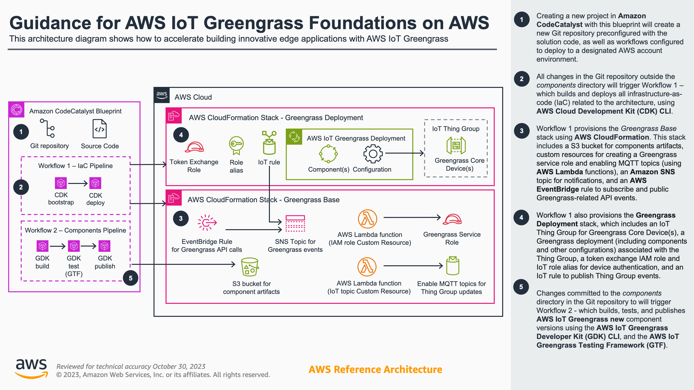

# Guidance for AWS IoT Greengrass Foundations on AWS

## Table of Contents

1. [Overview](#overview)
    - [Architecture](#architecture)
    - [Cost](#cost)
2. [Prerequisites](#prerequisites)
    - [Operating System](#operating-system)
    - [Third-party tools](#third-party-tools)
    - [AWS CDK bootstrap](#aws-cdk-bootstrap)
    - [Supported Regions](#supported-regions)
3. [Deployment Steps](#deployment-steps)
4. [Deployment Validation](#deployment-validation)
5. [Running the Guidance](#running-the-guidance)
6. [Next Steps](#next-steps)
7. [Cleanup](#cleanup)
8. [Additional Considerations, Limitations, and Feedback](#additional-considerations-limitations-and-feedback)
9. [Notices](#notices-optional)

## Overview

The AWS IoT Greengrass Foundations guidance enables customers to quickly and reliably build robust edge computing capabilities using AWS IoT Greengrass. By providing an automated CDK deployment, reusable workflows, and integrated components, this architecture reduces the complexity of setting up secure Greengrass environments. Companies can focus their efforts on developing innovative solutions instead of managing infrastructure. With minimal effort, hundreds of Greengrass-enabled devices can be deployed to collect, analyze, and act on data at the edge while seamlessly integrating with cloud capabilities. By processing data locally, Greengrass minimizes latency, reduces costs, and enhances privacy. This accelerated time-to-value couples with the scalability and global reach of AWS to provide a compelling platform for IoT innovation. The blueprint's proven patterns and automation free developers to rapidly deliver intelligent edge capabilities and transform their businesses.

### Architecture



### Cost

You are responsible for the cost of the AWS services used while running this Guidance. As of October 2023, the cost for running this Guidance with the default settings in the US West (Oregon) AWS Region is approximately **$XX per month**, using the following assumptions:

- ...
- ...
- ...

## Prerequisites

### Operating System

This Guidance is compatible with Mac, Linux, and Windows operating systems.

### Third-party tools

- [AWS Cloud Development Kit (AWS CDK) v2](https://docs.aws.amazon.com/cdk/v2/guide/home.html)
- TypeScript 3.8 or later (```npm -g install typescript```)
- [AWS Command Line Interface (CLI)](https://aws.amazon.com/cli/) (optional)

### AWS CDK bootstrap

This Guidance uses AWS CDK. Bootstrapping is the process of provisioning resources for the AWS CDK before you can deploy AWS CDK apps into an AWS environment (an AWS environment is a combination of an AWS account and Region). If you are using AWS CDK for the first time in an AWS environment, please run the following bootstrapping command:

```cdk bootstrap aws://ACCOUNT-NUMBER/REGION```

For additional information or customizations with AWS CDK bootstrapping, see [Bootstrapping](https://docs.aws.amazon.com/cdk/v2/guide/bootstrapping.html) in the AWS CDK documentation.

### Supported Regions

This code sample is compatible in all AWS Regions where AWS IoT Greengrass 

## Deployment Steps

### Option 1: Deploy via Amazon CodeCatalyst blueprint

1. Create a new project in Amazon CodeCatalyst
2. Select **Start with a blueprint** and choose the **AWS IoT Greengrass Foundations** blueprint. Click **Next**.
3. Give your project a name.
4. Select an **AWS account**, **IAM Role**, and **AWS Region**. Optionally configure settings under **Additional configuration options**.
5. Click **Create project**.
 
### Option 2: Manually deploy CDK application

1. Clone the repo using command ```git clone https://github.com/aws-solutions-library-samples/guidance-for-greengrass-foundations-on-aws.git```
2. Change the current directory to the repo folder using command ```cd guidance-for-greengrass-foundations-on-aws```
3. Install required packages in using command ```npm install```
4. Edit the following attribute values in **cdk.json**:

| Attribute value  | Description |
| ------------- | ------------- |
| `bucket_name_prefix` | The prefix of the Amazon S3 bucket name to be created  |
| `bucket_removal_policy` | The removal policy of the Amazon S3 bucket name to be created. Should be `DESTROY` or `RETAIN``.  |
| `stack_name` | The name of the AWS CloudFormation Stack to be created  |
| `thing_group_name_prefix` | The prefix of the AWS IoT Thing Group name  |
| `deployment_name` | The name of the AWS IoT Greengrass Deployment  |

5. Change the current directory to the `source` folder using command ```cd source```
6. Deploy the stack using the command ```cdk deploy``` 
7. Enter `y` when prompted with the question, ```Do you wish to deploy these changes (y/n)?```

## Deployment Validation

To validate deployment, use one or more of the following methods:

- From the [AWS Management Console](https://console.aws.amazon.com) in your web browser, open the CloudFormation console, click **Stacks** on the left-hand menu, and verify the stack with the name `<STACK_NAME>` has a status of **CREATE_COMPLETE**. After clicking the stack name, click the Outputs tab and take note of the `thing-group-name`, `thing-policy-name`, `tes-role-name`, and `tes-role-alias-name` values.
- If AWS CLI is installed, run the following command to validate the deployment has a status of **CREATE_COMPLETE**, and take note of the `thing-group-name`, `thing-policy-name`, `tes-role-name`, and `tes-role-alias-name` output values: 
    
    ```aws cloudformation describe-stacks --stack-name <STACK_NAME>```

## Running the Guidance

### Set up your device with AWS IoT Greengrass Core software

Read how to install the Greengrass Core software in [Install AWS IoT Greengrass Core software with automatic resource provisioning](https://docs.aws.amazon.com/greengrass/v2/developerguide/quick-installation.html), found in the [AWS IoT Greengrass Developer Guide, Version 2](https://docs.aws.amazon.com/greengrass/v2/developerguide/what-is-iot-greengrass.html).

When you get to the [step where you install the Greengrass Core software via command-line](https://docs.aws.amazon.com/greengrass/v2/developerguide/quick-installation.html#run-greengrass-core-v2-installer), use the `thing-group-name`, `thing-policy-name`, `tes-role-name`, and `tes-role-alias-name` noted from the [Deployment Validation](#deployment-validation) section as parameters.

For example, to install on Linux platform:

```
sudo -E java -Droot="/greengrass/v2" -Dlog.store=FILE \
  -jar ./GreengrassInstaller/lib/Greengrass.jar \
  --aws-region region \
  --thing-name MyGreengrassCore \
  --thing-group-name <thing-group-name> \
  --thing-policy-name <thing-policy-name> \
  --tes-role-name <tes-role-name> \
  --tes-role-alias-name <tes-role-alias-name> \
  --component-default-user ggc_user \
  --provision true \
  --setup-system-service true
```

## Next Steps

### Configuring components included in your Greengrass deployment

1. To add/remove/modify components included in your Greengrass deployment, update **config/deployment.components.json**.
2. Re-deploy the CDK application (manually with `cdk deploy`, or pushing a new commit to your CodeCatalyst repository, which will trigger a deployment).

### Modifying the CDK application

1. Update the infrastructure from this guidance architecture by making changes to this CDK application.
2. Re-deploy the CDK application (manually with `cdk deploy`, or pushing a new commit to your CodeCatalyst repository, which will trigger a deployment).

## Cleanup

To delete and cleanup deployed resources, use one of the following methods:

- To cleanup with AWS CDK:
    - If not currently in the `source` directory, run the command ```cd source```
    - Run the command ```cdk destroy```
    - Enter `y` when prompted ```Are you sure you want to delete: <STACK_NAME> (y/n)?```.
- From the [AWS Management Console](https://console.aws.amazon.com) in your web browser, open the CloudFormation console, click **Stacks** on the left-hand menu, select the stack with the name **<STACK_NAME>**, and click **Delete**.
- If AWS CLI is installed, run the following command: 
    

    ```aws cloudformation delete-stack --stack-name <STACK_NAME>```

## Feedback

For any feedback, questions, or suggestions, please [submit a new issue](https://github.com/aws-solutions-library-samples/guidance-for-greengrass-foundations-on-aws/issues).

## Notices

*Customers are responsible for making their own independent assessment of the information in this Guidance. This Guidance: (a) is for informational purposes only, (b) represents AWS current product offerings and practices, which are subject to change without notice, and (c) does not create any commitments or assurances from AWS and its affiliates, suppliers or licensors. AWS products or services are provided “as is” without warranties, representations, or conditions of any kind, whether express or implied. AWS responsibilities and liabilities to its customers are controlled by AWS agreements, and this Guidance is not part of, nor does it modify, any agreement between AWS and its customers.*
